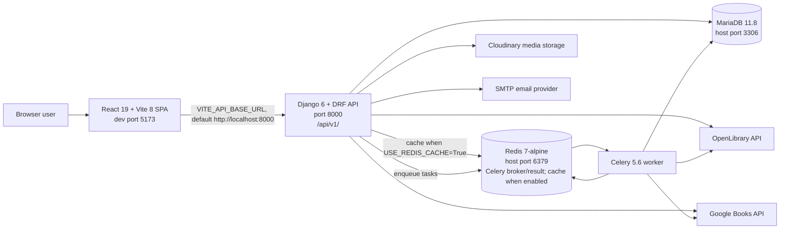

# BookNest

BookNest is a full-stack book discovery and reading community for readers who need searchable catalogs, profiles, collections, ratings, reviews, follows, notifications, and recommendations, and for staff users who manage catalog and recommendation data through the same web system.

No build or license badge is rendered here because this checkout does not contain a `.github/workflows/` directory or a `LICENSE` file.

## System Architecture



The frontend is a Vite single-page application in [client/](client/) and the backend is a Django modular monolith in [server/](server/). The backend persists application data in MariaDB, uses Redis for Celery broker/result storage and Redis-backed cache when enabled, stores uploaded media through Cloudinary, and enriches catalog data from OpenLibrary and Google Books.

## Repository Structure

Important project files and directories, verified two levels deep:

```text
BookNest/
|-- README.md
|-- .gitignore
|-- client/
|   |-- README.md
|   |-- eslint.config.js
|   |-- index.html
|   |-- package.json
|   |-- package-lock.json
|   |-- public/
|   |-- tsconfig.json
|   |-- vercel.json
|   |-- vite.config.js
|   `-- src/
|-- docs/
|   `-- api-endpoints.md
`-- server/
    |-- README.md
    |-- .dockerignore
    |-- .env.example
    |-- .python-version
    |-- Dockerfile
    |-- docker-compose.yml
    |-- manage.py
    |-- pyproject.toml
    |-- uv.lock
    |-- apps/
    `-- config/
```

Local generated directories such as `client/node_modules/`, `client/dist/`, `server/.venv/`, `server/logs/`, `server/media/`, and tool caches are ignored or local-only and are intentionally omitted from the tree above.

| Path | Role |
| --- | --- |
| [client/README.md](client/README.md) | Source of truth for frontend architecture, routes, scripts, testing, deployment notes, and conventions. |
| [server/README.md](server/README.md) | Source of truth for backend architecture, data model, API surface, environment variables, Docker, testing, and deployment notes. |
| [client/](client/) | React/Vite frontend package for public, authenticated, and staff web workflows. |
| [client/package.json](client/package.json) | Frontend npm scripts and dependency declarations. |
| [client/package-lock.json](client/package-lock.json) | Locked frontend dependency graph used by `npm ci`. |
| [client/vercel.json](client/vercel.json) | SPA rewrite rule for Vercel-hosted BrowserRouter routes. |
| [server/](server/) | Django REST API, Celery configuration, domain apps, migrations, management commands, and backend Docker assets. |
| [server/.env.example](server/.env.example) | Backend environment template. |
| [server/Dockerfile](server/Dockerfile) | Production-style backend container build. |
| [server/docker-compose.yml](server/docker-compose.yml) | Local backend stack with MariaDB, Redis, migrations, API, and Celery. |
| [server/pyproject.toml](server/pyproject.toml) | Backend Python runtime constraint, dependency groups, and tool configuration. |
| [server/uv.lock](server/uv.lock) | Locked backend Python dependency graph used by `uv sync --frozen`. |
| [docs/api-endpoints.md](docs/api-endpoints.md) | Checked-in endpoint guide for the API. |
| [.gitignore](.gitignore) | Ignore rules for local secrets, Python artifacts, Node artifacts, logs, Docker overrides, and editor files. |
| [README.md](README.md) | Project-level entry point and cross-stack operating guide. |

There is no root `package.json`, root `docker-compose.yml`, `docker-compose.prod.yml`, `Makefile`, `turbo.json`, `pnpm-workspace.yaml`, root `.env.example`, `.github/` directory, or `LICENSE` file in this checkout.

## Tech Stack Summary

### Frontend

Versions are summarized from [client/README.md](client/README.md), which resolves package specs against `package-lock.json`.

| Technology | Version | Role |
| --- | --- | --- |
| React / React DOM | 19.2.5 | Component runtime and DOM rendering. |
| TypeScript | 6.0.3 | Strict frontend typing. |
| Vite | 8.0.10 | Development server, production build, and preview server. |
| React Router DOM | 7.15.0 locked | Browser routing, route guards, params, and lazy page rendering. |
| TanStack Query | 5.80.2 locked | API-backed query and mutation cache. |
| Axios | 1.16.0 locked | Shared HTTP client, auth headers, and token refresh handling. |
| Tailwind CSS / `@tailwindcss/vite` | 4.2.4 locked | CSS-first utility styling and theme tokens. |
| Formik / Yup | 2.4.6 / 1.6.1 locked | Auth form state and validation schemas. |
| Vitest / React Testing Library / jsdom | 4.1.5 / 16.3.2 / 29.1.1 | Frontend test runner, render utilities, and DOM test environment. |

### Backend

Versions are summarized from [server/README.md](server/README.md), which resolves Python dependencies from `uv.lock` and service versions from Docker configuration.

| Technology | Version | Role |
| --- | --- | --- |
| Python | 3.14.4 | Backend runtime required by `.python-version` and `pyproject.toml`. |
| Django | 6.0.5 | Web framework, ORM, settings, migrations, admin, and auth foundation. |
| Django REST Framework | 3.17.1 | API views, serializers, permissions, throttling, and pagination. |
| drf-spectacular | 0.29.0 | OpenAPI 3.1 schema, Swagger UI, and ReDoc. |
| dj-rest-auth / django-allauth / Simple JWT | 7.2.0 / 65.16.1 / 5.5.1 | Email-first account flows and JWT authentication. |
| MariaDB / mysqlclient | 11.8 image / 2.2.8 | Application database and Django database adapter. |
| Redis / django-redis | 7-alpine image / 6.0.0 | Cache backend and Celery broker/result infrastructure. |
| Celery | 5.6.3 | Async recommendation and catalog integration tasks. |
| Cloudinary / django-cloudinary-storage | 1.44.2 / 0.3.0 | Media upload and storage backend. |
| Gunicorn / WhiteNoise | 25.3.0 / 6.12.0 | Production WSGI process and static file serving. |
| pytest / Ruff / mypy | 9.0.3 / 0.15.12 / 1.20.2 | Backend tests, linting/formatting, and type checking. |

## Prerequisites

| Tool or service | Required version | Source | Needed for |
| --- | --- | --- | --- |
| Git | No version pinned | Repository uses Git and has a GitHub remote | Clone and branch workflow. |
| Python | 3.14.4 | [server/.python-version](server/.python-version), [server/pyproject.toml](server/pyproject.toml) | Backend development and management commands. |
| `uv` | Local version not pinned; Dockerfile copies 0.11.3 | [server/Dockerfile](server/Dockerfile) | Backend dependency sync and command execution. |
| Node.js | `^20.19.0 || >=22.12.0` | Vite 8.0.10 engine requirement documented in [client/README.md](client/README.md) and present in [client/package-lock.json](client/package-lock.json) | Frontend install, dev server, build, lint, and tests. |
| npm | No npm version pinned; lockfile version is npm lockfile v3 | [client/package-lock.json](client/package-lock.json) | Frontend dependency install with `npm ci`. |
| Docker with Compose | Compose v2 workflow expected; no exact Docker Engine version pinned | [server/docker-compose.yml](server/docker-compose.yml) | Local MariaDB, Redis, backend container, migrations, and Celery worker. |
| MariaDB | 11.8 through Compose; MariaDB 11+ for native service compatibility per backend docs | [server/docker-compose.yml](server/docker-compose.yml), [server/README.md](server/README.md) | Backend database. |
| Redis | 7-alpine through Compose | [server/docker-compose.yml](server/docker-compose.yml) | Redis cache, Celery broker, and Celery result backend. |
| Cloudinary account | No version | [server/.env.example](server/.env.example), [server/README.md](server/README.md) | Required when media uploads need to work. |

## Full-Stack Local Setup

There is no root workspace script or Makefile. Run the backend and frontend from separate terminals.

Clone the repository:

```bash
git clone https://github.com/MahmoudAhmed184/BookNest.git
cd BookNest
```

Start backend dependencies and the API:

```bash
cd server
cp .env.example .env
uv sync --frozen
docker compose up -d db redis
uv run python manage.py migrate
uv run python manage.py init_integrations
uv run python manage.py rebuild_search_index
uv run python manage.py runserver 127.0.0.1:8000
```

Start the frontend in another terminal:

```bash
cd client
npm ci
printf 'VITE_API_BASE_URL=http://localhost:8000\n' > .env.local
npm run dev
```

Local URLs:

| Service | URL |
| --- | --- |
| Frontend | `http://localhost:5173/` by default; Vite prints a different URL if 5173 is busy. |
| API base | `http://localhost:8000/api/v1/` |
| API Swagger UI | `http://localhost:8000/api/v1/docs/` |
| API ReDoc | `http://localhost:8000/api/v1/redoc/` |
| Django admin | `http://localhost:8000/admin/` |

Environment setup at a project level:

- Backend: copy [server/.env.example](server/.env.example) to `server/.env`. It covers Django settings mode, secrets, JWT, MariaDB, Redis/Celery, Cloudinary, CORS/CSRF, SMTP, API defaults, and logging. See [server/README.md#environment-variables](server/README.md#environment-variables) for the full backend explanation.
- Frontend: there is no `client/.env.example`. `VITE_API_BASE_URL` is optional for local development because `client/src/config/env.ts` defaults to `http://localhost:8000`. Set it in `client/.env.local` when the API runs somewhere else. See [client/README.md#environment-variables](client/README.md#environment-variables).
- Database: the local commands above use `server/docker-compose.yml` to start MariaDB and Redis, then apply migrations. `init_integrations` creates default OpenLibrary and Google Books source rows; `rebuild_search_index` rebuilds search labels and autocomplete terms from available catalog data.

## Docker and Compose

There is no root Compose file that starts the entire frontend plus backend. The discoverable Compose file is [server/docker-compose.yml](server/docker-compose.yml), and it starts the backend stack.

Run the backend stack with Compose:

```bash
cd server
cp .env.example .env
docker compose up --build
```

Services started by `server/docker-compose.yml`:

| Service | Technology | Ports | Purpose |
| --- | --- | --- | --- |
| `db` | MariaDB 11.8 | `127.0.0.1:${DB_HOST_PORT:-3306}:3306` | Application database. |
| `redis` | Redis 7-alpine | `127.0.0.1:${REDIS_HOST_PORT:-6379}:6379` | Cache, Celery broker, and Celery result backend. |
| `migrate` | Local backend image | None | One-shot `python manage.py migrate --noinput` gate. |
| `web` | Local backend image running Django dev server | `127.0.0.1:${WEB_PORT:-8000}:8000` | Development API server. |
| `celery` | Local backend image running Celery | None | Async task worker. |

The Compose file also creates `mariadb_data`, `redis_data`, and `app_venv` volumes, bind-mounts backend source, and mounts `server/media` and `server/logs`.

There is no `docker-compose.prod.yml` or production Compose file in this checkout. The production backend container artifact is [server/Dockerfile](server/Dockerfile).

## Running Tests Across the Stack

There is no root test runner. Run service tests directly.

Frontend tests:

```bash
cd client
npm test
```

Backend tests:

```bash
cd server
uv run pytest
```

Backend coverage:

```bash
cd server
uv run coverage run -m pytest
uv run coverage report -m
```

Useful quality checks exposed by the service packages:

```bash
cd client
npm run lint
npx tsc --noEmit
```

```bash
cd server
uv run ruff check .
uv run mypy .
uv run python manage.py check
```

The frontend has no E2E framework, no dedicated integration-test script, and no coverage script. The backend has no E2E or contract test suite in the source tree.

## Environment Variables

This table is the project-level index. Backend requiredness and detailed behavior are documented in [server/README.md#environment-variables](server/README.md#environment-variables); frontend behavior is documented in [client/README.md#environment-variables](client/README.md#environment-variables).

| Variable | Service | Required / optional | Purpose |
| --- | --- | --- | --- |
| `VITE_API_BASE_URL` | Frontend | Optional locally; required when the API is not `http://localhost:8000` | Base URL used by frontend Axios helpers and media URL resolution. |
| `DJANGO_SETTINGS_MODULE` | Backend | Required for explicit runtime mode | Selects development, production, or testing settings. |
| `DEBUG` | Backend | Optional in development; should be false in production | Enables Django debug behavior. |
| `SECRET_KEY` | Backend | Required in production | Django signing secret. |
| `JWT_SIGNING_KEY` | Backend | Required in production | SimpleJWT HS512 signing key. |
| `JWT_ACCESS_TOKEN_MINUTES` | Backend | Optional | Access token lifetime. |
| `JWT_REFRESH_TOKEN_DAYS` | Backend | Optional | Refresh token lifetime. |
| `JWT_ROTATE_REFRESH_TOKENS` | Backend | Optional | Enables refresh token rotation. |
| `JWT_BLACKLIST_AFTER_ROTATION` | Backend | Optional | Blacklists old refresh tokens after rotation. |
| `JWT_UPDATE_LAST_LOGIN` | Backend | Optional | Controls SimpleJWT last-login updates. |
| `JWT_AUTH_HTTPONLY` | Backend | Optional; production defaults true if unset | Controls whether JWT auth cookies are HTTP-only. |
| `DB_NAME` | Backend | Required for MariaDB deployments | Database name. |
| `DB_USER` | Backend | Required for MariaDB deployments | Database user. |
| `DB_PASSWORD` | Backend | Required for MariaDB deployments | Database password. |
| `DB_HOST` | Backend | Required outside Compose defaults | Database host. |
| `DB_PORT` | Backend | Optional | Database port used by Django. |
| `DB_CONN_MAX_AGE` | Backend | Optional | Persistent database connection lifetime in seconds. |
| `DB_CONN_HEALTH_CHECKS` | Backend | Optional | Enables Django database connection health checks. |
| `USE_MYSQL_TEST_DB` | Backend | Optional | Uses configured MySQL/MariaDB for tests when true; otherwise tests use in-memory SQLite. |
| `DB_HOST_PORT` | Backend | Optional | Host port mapped to the MariaDB container. |
| `MARIADB_ROOT_PASSWORD` | Backend | Required for Compose database bootstrap | Root password for the MariaDB container. |
| `CLOUDINARY_CLOUD_NAME` | Backend | Required for Cloudinary media uploads | Cloudinary account cloud name. |
| `CLOUDINARY_API_KEY` | Backend | Required for Cloudinary media uploads | Cloudinary API key. |
| `CLOUDINARY_API_SECRET` | Backend | Required for Cloudinary media uploads | Cloudinary API secret. |
| `USE_REDIS_CACHE` | Backend | Optional in development | Enables Redis-backed Django cache in development when true. |
| `REDIS_URL` | Backend | Required when Redis cache is used | Django Redis cache URL. |
| `CELERY_BROKER_URL` | Backend | Required for async tasks | Celery broker URL. |
| `CELERY_RESULT_BACKEND` | Backend | Optional; defaults to broker URL in code | Celery result backend URL. |
| `REDIS_HOST_PORT` | Backend | Optional | Host port mapped to the Redis container. |
| `WEB_PORT` | Backend | Optional | Host port mapped to the Django web container. |
| `UID` | Backend Compose | Optional | Host user ID passed as a Docker build argument; defaults to `1000`. |
| `GID` | Backend Compose | Optional | Host group ID passed as a Docker build argument; defaults to `1000`. |
| `CELERY_LOG_LEVEL` | Backend | Optional | Celery worker log level. |
| `CELERY_ACCEPT_CONTENT` | Backend | Optional; template-only in current settings | Present in `.env.example`; current settings hard-code JSON accepted content. |
| `CELERY_TASK_SERIALIZER` | Backend | Optional; template-only in current settings | Present in `.env.example`; current settings hard-code JSON task serialization. |
| `CELERY_RESULT_SERIALIZER` | Backend | Optional; template-only in current settings | Present in `.env.example`; current settings hard-code JSON result serialization. |
| `CELERY_TIMEZONE` | Backend | Optional | Celery timezone. |
| `CELERY_TASK_SOFT_TIME_LIMIT` | Backend | Optional | Celery soft time limit in seconds. |
| `CELERY_TASK_TIME_LIMIT` | Backend | Optional | Celery hard time limit in seconds. |
| `CELERY_RESULT_EXPIRES` | Backend | Optional | Celery result expiration in seconds. |
| `ALLOWED_HOSTS` | Backend | Required in production | Django host header allow-list. |
| `CSRF_TRUSTED_ORIGINS` | Backend | Required for browser clients using CSRF/cookies | Trusted origins for CSRF validation. |
| `CORS_ALLOWED_ORIGINS` | Backend | Required for browser clients | Explicit browser CORS origin allow-list. |
| `CORS_ALLOW_CREDENTIALS` | Backend | Optional | Allows cookies and credentials in CORS responses. |
| `SECURE_SSL_REDIRECT` | Backend | Optional; production defaults true | Redirects HTTP to HTTPS in production settings. |
| `SECURE_HSTS_SECONDS` | Backend | Optional | HSTS max-age seconds. |
| `SECURE_HSTS_INCLUDE_SUBDOMAINS` | Backend | Optional | Adds HSTS includeSubDomains. |
| `SECURE_HSTS_PRELOAD` | Backend | Optional | Adds HSTS preload directive. |
| `API_SCHEMA_PUBLIC` | Backend | Optional | Controls public schema/docs access. |
| `DRF_PAGE_SIZE` | Backend | Optional | Default DRF page size. |
| `DRF_MAX_PAGE_SIZE` | Backend | Optional | Maximum client-selected DRF page size. |
| `DRF_ANON_RATE` | Backend | Optional | DRF anonymous throttle rate. |
| `DRF_USER_RATE` | Backend | Optional | DRF authenticated throttle rate. |
| `EMAIL_BACKEND` | Backend | Optional | Django email backend; development defaults to console. |
| `EMAIL_HOST` | Backend | Required for SMTP delivery | SMTP host. |
| `EMAIL_PORT` | Backend | Optional | SMTP port. |
| `EMAIL_USE_TLS` | Backend | Optional | Enables SMTP TLS. |
| `EMAIL_HOST_USER` | Backend | Required for authenticated SMTP | SMTP username. |
| `EMAIL_HOST_PASSWORD` | Backend | Required for authenticated SMTP | SMTP password. |
| `DEFAULT_FROM_EMAIL` | Backend | Optional | Sender address for account email. |
| `FRONTEND_URL` | Backend | Optional in settings | Intended frontend URL for account links; the current reset adapter behavior is detailed in the backend README. |
| `SITE_NAME` | Backend | Optional | Email subject prefix and site name. |
| `DJANGO_LOG_DIR` | Backend | Optional | Log directory. |
| `DJANGO_LOG_FILE` | Backend | Optional | Rotating Django log file path. |
| `RECOMMENDATION_LOG_FILE` | Backend | Optional | Rotating recommendation logger file path. |
| `DJANGO_LOG_MAX_BYTES` | Backend | Optional | Rotating log max bytes. |
| `DJANGO_LOG_BACKUP_COUNT` | Backend | Optional | Rotating log backup count. |
| `CACHE_TTL` | Backend | Optional | Default cache TTL used by settings. |
| `CACHE_KEY_PREFIX` | Backend | Optional | Cache key prefix, including search enrichment suppression keys. |
| `DATA_UPLOAD_MAX_MEMORY_SIZE` | Backend | Optional; supported by code, not in `.env.example` | Maximum request body memory size for uploads. |
| `FILE_UPLOAD_MAX_MEMORY_SIZE` | Backend | Optional; supported by code, not in `.env.example` | Maximum uploaded file memory size. |
| `EMAIL_TIMEOUT` | Backend | Optional; supported by code, not in `.env.example` | SMTP timeout. |
| `SESSION_COOKIE_SAMESITE` | Backend | Optional; supported by code, not in `.env.example` | Session cookie SameSite policy. |
| `CSRF_COOKIE_SAMESITE` | Backend | Optional; supported by code, not in `.env.example` | CSRF cookie SameSite policy. |

## Deployment Overview

No checked-in CI/CD workflow exists. There is no `.github/workflows/`, root production Compose file, `fly.toml`, `railway.toml`, `render.yaml`, `netlify.toml`, or `Procfile`.

Frontend deployment artifacts:

- [client/vercel.json](client/vercel.json) rewrites all paths to `/index.html` so `BrowserRouter` deep links work on Vercel.
- The frontend build command is:

```bash
cd client
npm ci
VITE_API_BASE_URL=https://api.example.com npm run build
```

- The build output is `client/dist/`. Replace `https://api.example.com` with the deployed backend origin.
- No checked-in Vercel project binding or deployment trigger is present.

Backend deployment artifacts:

- [server/Dockerfile](server/Dockerfile) builds a production-style image from `python:3.14-slim`, copies `uv` 0.11.3, installs the production dependency group, runs `collectstatic` at build time, creates a non-root runtime user, exposes port 8000, and starts Gunicorn against `config.wsgi:application`.
- Build the image with:

```bash
cd server
docker build -t booknest-backend .
```

- Production runs must provide `DJANGO_SETTINGS_MODULE=config.settings.production`, `SECRET_KEY`, `JWT_SIGNING_KEY`, non-empty `ALLOWED_HOSTS`, MariaDB connection variables, Redis/Celery URLs when cache/tasks are needed, CORS/CSRF origins for the browser client, Cloudinary credentials for media, and SMTP variables for real email.
- Migrations still need to run as a release step before serving traffic.

The repository does not define where either service is deployed in production or what event triggers a production deployment.

## Contributing

There is no `.github/CONTRIBUTING.md`, `.github/PULL_REQUEST_TEMPLATE.md`, `CODEOWNERS`, `.commitlintrc`, commitlint config, Husky setup, lint-staged setup, or CI workflow in this checkout.

Observed branch names in the local Git repository use `<type>/<short-kebab-description>`, for example `fix/backend-local-services`, `chore/tailwind-v4-migration`, and `chore/mariadb-data-cleanup`. Recent commits use Conventional Commit-style subjects such as `feat(scope): ...`, `fix(scope): ...`, `chore(scope): ...`, and `refactor(scope): ...`; this format is not enforced by checked-in tooling.

Practical PR process from the repository structure:

1. Branch from `main` using the observed `<type>/<short-kebab-description>` pattern.
2. Keep frontend changes aligned with [client/README.md](client/README.md) conventions and backend changes aligned with [server/README.md](server/README.md) conventions.
3. Run the relevant commands before opening a PR:

```bash
cd client
npm run lint
npm test
```

```bash
cd server
uv run ruff check .
uv run mypy .
uv run pytest
```

4. Open a GitHub pull request against `main` and include the change summary plus the commands run. Required reviewers and required checks are not defined in repository files.

## License

No `LICENSE` file is present in this checkout, so the project license name and year cannot be determined from repository contents. Add a license file before treating this as an open-source distribution.
